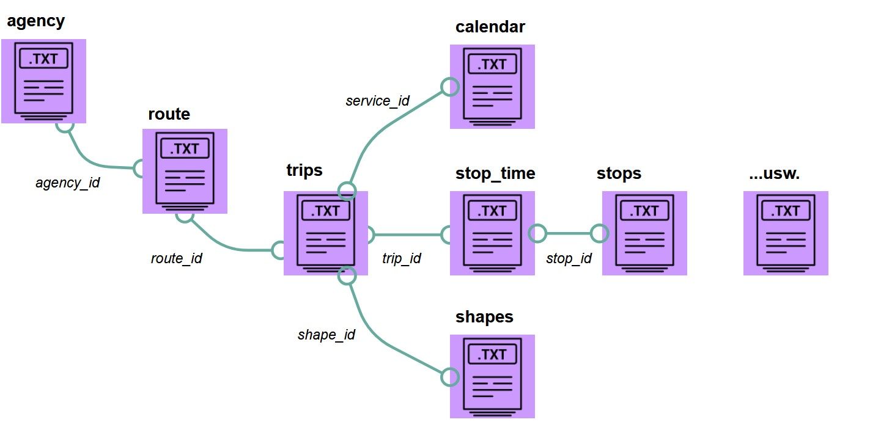

# About 
This repository hosts the code and resources for geoprocessing open public transit data, and to explore the mobility in public transit service frequency using GTFS data of Germany. It includes the graphical model builder tool of QGIS for processing raw GTFS data, generating Distance Indicators, and implementing Local Moran's Index for spatial analysis using python.

Download and Find more details on the published curatated dataset: 
Sikder, Sujit Kumar, 2025, "Replication package for: Urban Public Transit Frequency Indicator in Germany", [https://doi.org/10.71830/ABPCUS](https://doi.org/10.71830/ABPCUS), ioerDATA, V1 

# Reading data

## Layer data folder: 
- each directory contains six uniques datafiles 
- Dataformat: geopackage (.gpkg) only
- Raster grid size: 1 KM
- folder name: xx (city id) + yy (city name)
- file name: xx ( day) + yy (time) _+ zz (city name)
- wk_am = weekdays peak-traffic morning hours (6:00-8:59) 
- wk_am: weekdays peak-traffic afternoon hours (14:00-16:59)
- sat_am = Saturday peak-traffic morning hours (6:00-8:59) 
- sat_pm = Saturday peak-traffic afternoon hours (14:00-16:59)
- sun_am = Saturday peak-traffic morning hours (6:00-8:59)
- sun_pm = Saturday peak-traffic afternoon hours (14:00-16:59)

### Field names

## Other folder
- contains additional elements, informations and data about the layer data
- city_id_type_matching_table.csv: helps to find unique city id-wise relations with other data sources and classification of city types
- Notebooks: interactive Jupyternotebooks used for understanding data and ready to use workflow with the data and demo analysis

# Data Source

## GTFS
 
Primary data for this study is the open public transit feed data (GTFS). The GTFS data was collectedfrom (https://gtfs.de/de/feeds). They offer 3 different types of data for Germany. These are: 1) Long Distance Rail 2) Local Transit and 3) Regional Rail. For the current study local transit and regional rail data were downloaded. This data comes in .zip format. GTFS data of Germany contains 8 text files in .txt format. Table 1 shows details information of each text file. Though, it was supposed to be updated every week, author noticed during the study period same data was provided until 10.08.2022.

### Table 1: Properties of the Collected GTFS Data

|**Feed Name** | **File size (MB)**| **Unique trips** | **Stops** | **Date** |
|:---:| :---:|:---:|:---:|:---:| 
| Local transit Germany |181|1,3 M|460 K| July 10, 2022|
| Regional trains Germany|6,7|64 K|15 K| July 10, 2022|

## Structure of the Collected GTFS Data
It is seen from Table 2 that each of the collected GTFS dataset has 7 .txt files, apart from them GTFS data also have feed_info.txt file. Details of each file are given below:
### Table 2: Structure of the GTFS Files
|**File** | **Field 1**| **Field 2** | **Field 3** | **Field 4** |**Field 5**| **Field 6** | **Field 7** | **Field 8** | **Field 9** | **Field 10** |
|:---:| :---:|:---:|:---:|:---:|:---:| :---:|:---:|:---:|:---:|:---:|
|agency.txt|agency_id|agency_name|agency_url|agency_timezone||| ||||
|calendar.txt|monday|tuesday|wednesday|thursday|friday|saturday|sunday|start_date|end_date|service_id|
|calendar_dates.txt|service_id|extension_type|date||||||||
|routes.txt|route_long_name|route_short_name|agency_id|route_type|route_id||||||
|stop_times.txt|trip_id|arrival_time|departure_time|stop_id|stop_sequence|pickup_type|drop_off_type||||
|stops.txt|stops_name|stop_id|stop_lat| stop_lon|||||||
|trips.txt|route_id|service_id|direction_id|trip_id|||||||

**agency.txt:** It provides information about the public transport operator of this feed. They are uniquely identified with the agency_id field. This file also provides the timezone in the format of HH:MM:SS. It is important to the have same timezone when there are multiple agencies.

**calendar.txt:** This file provides service time for each day of the week. Starting and end dates of the feeds are also provided in this file. This file has a unique service_id that relates trips.txt file.

**calendar_dates.txt:** In this file, any exception of the service is provided. This allows to know considerable service variation. This file also relates the trips.txt file with a unique service_id field.

**routes.txt:** This file group trips into single services that are shown to users. The route_type field holds the mode of the transportation used for that route. Different route types available in the collected GTFS data are as follows:

# Classification of cities 
Definition of Urban population by city size - OECD countries are classified as: 
1. large metropolitan areas if they have a population of 1.5 million or more 
2. metropolitan areas if their population is between 500,000 and 1.5 million 
3. medium-size urban areas if their population is between 200,000 and 500,000
4. small urban areas if their population is between 50,000 and 200,000
   
Source: OECD (2024), Urban population by city size (indicator). doi: 10.1787/b4332f92-en (Accessed on 08 May 2024), https://data.oecd.org/popregion/urban-population-by-city-size.htm

# Jupyternotebooks
## Notebooks 
- [Exploratory data analysis](https://github.com/ssujit/move_sustainable/blob/main/notebook/1_exploratory_data_analysis.ipynb)
- [Spatial statistics with contiguity weights](https://github.com/ssujit/move_sustainable/blob/main/notebook/2_spatial_statistics_contiguity.ipynb)
- [Spatial statistics with KNN weights](https://github.com/ssujit/move_sustainable/blob/main/notebook/2_spatial_statistics_neighborhood.ipynb)

## Note: The interactive notebook can be run using binderhub: [https://mybinder.org](https://mybinder.org)

